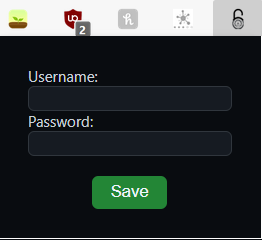

# Auto Moodle Login

An extension to auto login to moodle because I can't solve 103-87

### Installation

1. Clone the git repo
2. Switch on 'developer mode' in Chrome Extensions
3. Load the unpacked extension

### Setting Up

After installing this extension , simply click on the icon of the extension and save your details. 

Yes! Its that simple.

### Contributing

* Clone and send pull requests if you have any features to add or bugs to fix!
* Having a fork is also cool!

### Updating

1. Go to the location where you've cloned the repo
2. `git pull` to sync changes
3. Go to chrome and reload the extension
